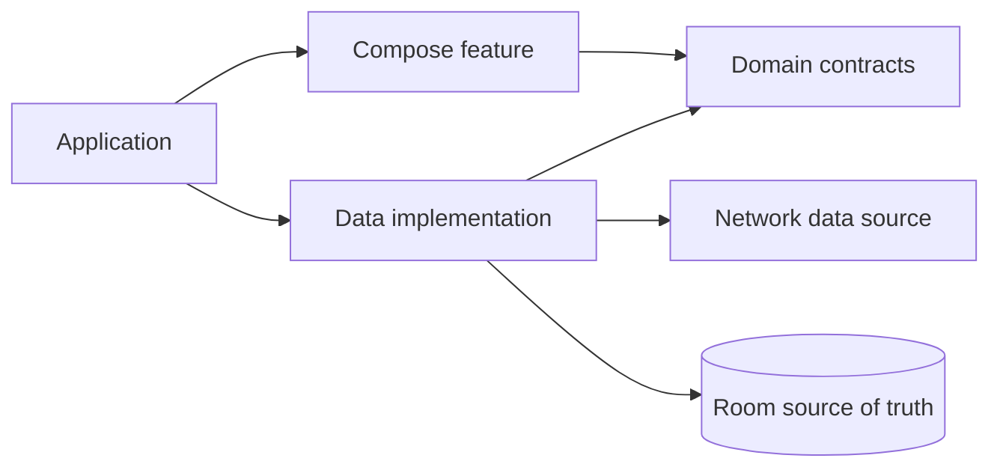

# Architecture

The template uses a pragmatic layered architecture with a deterministic Catalog vertical slice.

## Boundaries

- `core:model` has no project dependencies.
- `core:domain` depends only on model and portable libraries.
- features depend on contracts, shared UI, and navigation, never concrete data modules.
- `core:data` composes network and database implementations behind domain contracts.
- optional platform integrations remain isolated and are removed by the bootstrap when unselected.

Navigation keys are serializable. Feature modules contribute Navigation 3 entries through an
`EntryProviderInstaller`; the application owns the saveable back stack and adaptive scene strategy.
